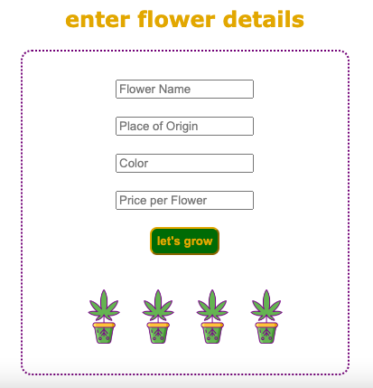
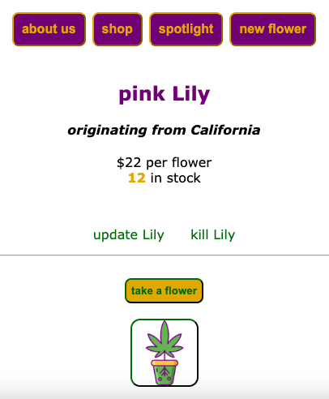
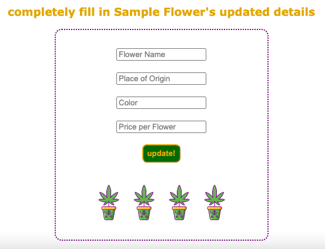
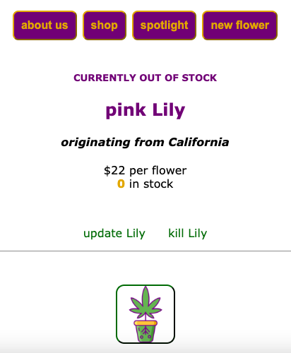
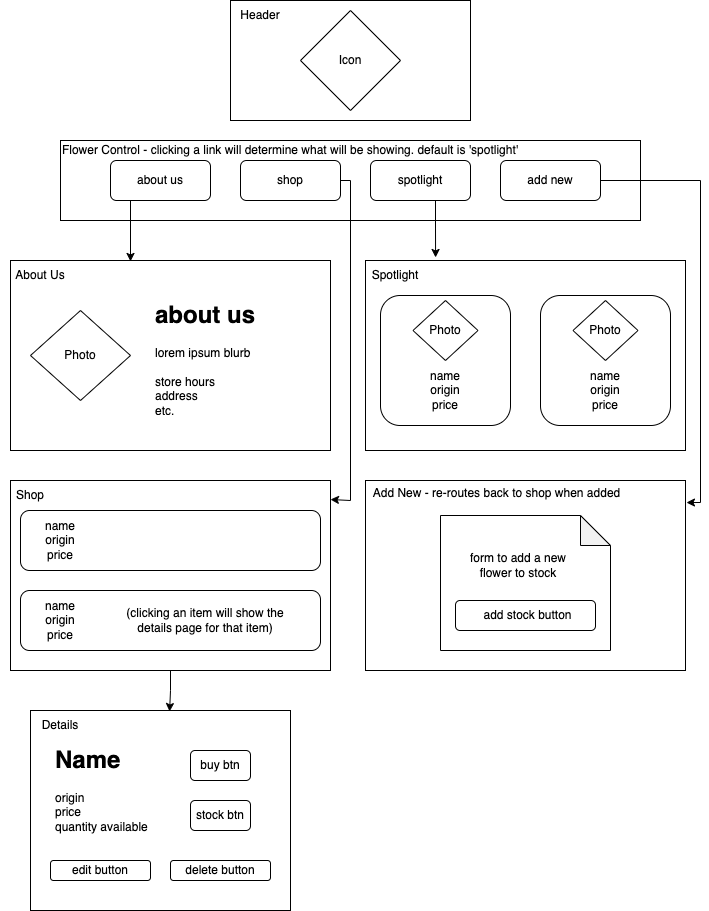
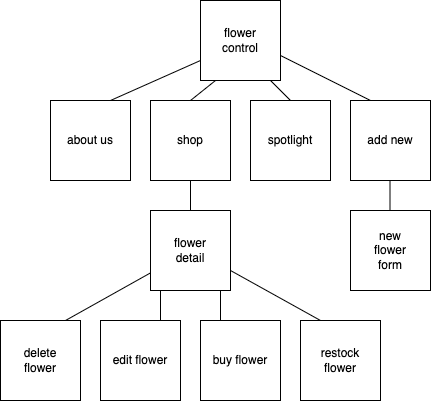

# Flower to the People

#### By E. Luckie ☀️

#### This site was created as a tool for a faux business to keep track of inventory levels of their products. Users are able to add/restock items, see a list of items available, "sell" items (decrement stock levels), and delete items.

## Technologies Used

* React
* JSX
* JavaScript
* Markdown
* Drawio
* Git

## Description

This site acts as a simple tool to keep track of inventory for a faux flower business. Upon opening or refreshing the site, the default tab is the _**spotlight**_ tab. From every page, users are able to navigate to the _**about us**_ page, _**shop**_ page, _**spotlight**_ page, or the _**new flower**_ page. From the **shop** page, users are able to click on any flower to navigate to that flower's detail page, where they are able to edit, delete, buy, or restock.
<br/><br/>

| this link | displays a page that shows... |
| --------- | -------------------------- |
| _about us_ | blurb about fake company, store hours, & store location/contact |
| _shop_ | list of current flowers in available. if no flowers are available, page will be empty |
| _spotlight_ | three faux "top staff picks" flowers for sale |
| _new flower_ | form to add a new flower to site |
<br/>

## Navigating the Site

>
>* filling in all details will add a new flower to the available flowers in **shop**
>* the default quantity for adding a new flower is by the dozen (12)
<br/><br/><br/>


>
>* clicking _update {flower name}_ will take user to the edit flower form
>* clicking _kill {flower name}_ will delete the flower from the site and re-route user to the **shop** page
>* clicking _take a flower_ will lower the in stock level of the selected flower by 1. changes will reflect immediately
>* when down to 3 or less flowers in stock, "almost sold out" message will display on flower
>* clicking _the button with the site icon_ will restock the selected flower. the default is by the dozen (12) and changes will be reflected immediately
<br/><br/><br/>

>
>* filling in all details will update the selected flower (noted in the yellow text by name)
>* form must be fully filled out
>* once updated, user is re-routed to shop page
<br/><br/><br/>

>
>* when in stock level reaches 0, "currently out of stock" message displays
>* note, there is also no _take a flower_ button if flower is out of stock, only the restock button
<br/><br/><br/>


## Diagrams

#### Site Diagram




#### Component Diagram




## Setup/Installation Requirements

1. Clone this repository to your desktop
2. Navigate to the top level of this directory in your computer’s terminal
3. Run the code ```npm install``` in your terminal to install the necessary packages and plug-ins
4. Run the code ```npm run start``` in your terminal to start the application in development mode and open the project in your web browser


## Known Bugs

* Needs error handling for update form - if not filled in, will update all details to null


## Stretch Plans

* As a user, I want to have flower prices to be color-coded for easy readability. This could be based on their price, their origin or color, or the amount of flowers left.


## License

MIT License

Copyright (c) 2023 Luckie


____________________

This project was bootstrapped with [Create React App](https://github.com/facebook/create-react-app).